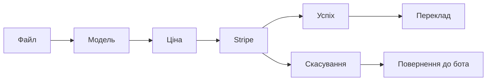

# 🚀 Швидкий старт - Платіжна система

## ✅ Що зроблено

### 🎯 Основні покращення
- ❌ **Була заглушка** → ✅ **Повноцінна Stripe інтеграція**  
- ❌ **Базовий UI** → ✅ **Красиві HTML сторінки**
- ❌ **Мінімальна інформація** → ✅ **Детальний UX**
- ❌ **Без обробки помилок** → ✅ **Надійна система**

## 🏗️ Структура файлів

```
Bot/
├── templates/                    # 🆕 HTML шаблони
│   ├── payment_success.html     # Сторінка успішної оплати
│   ├── payment_cancel.html      # Сторінка скасування  
│   └── payment_info.html        # Інформаційна сторінка
├── utils/
│   ├── payment_utils.py         # ✅ Оновлено - Stripe API
│   ├── error_handler.py         # 🆕 Обробка помилок
│   └── template_utils.py        # 🆕 Рендеринг HTML
├── handlers/
│   ├── payment.py               # ✅ Повністю переписано
│   └── webhook.py               # ✅ Оновлено з HTML
├── keyboards/
│   └── inline.py                # ✅ Покращені клавіатури
└── PAYMENT_SETUP.md            # 🆕 Детальна документація
```

## ⚡ Швидкий запуск

### 1. Налаштування Stripe
```bash
# Додайте у .env файл:
STRIPE_SECRET_KEY=sk_test_...
STRIPE_WEBHOOK_SECRET=whsec_...  
WEBHOOK_URL=https://yourdomain.com
```

### 2. Stripe Dashboard
1. Створіть webhook: `https://yourdomain.com/webhook/stripe`
2. Виберіть події: `checkout.session.completed`, `checkout.session.expired`
3. Скопіюйте webhook secret

### 3. Перевірка
```bash
# Перевірте шаблони
python3 -c "from utils.template_utils import validate_template_files; print(validate_template_files())"

# Результат: {'payment_success.html': True, 'payment_cancel.html': True, 'payment_info.html': True}
```

## 🔄 Користувацький потік



1. **Файл** → Аналіз символів
2. **Модель** → Basic (0.65€) або Epic (0.95€)  
3. **Оплата** → Stripe вікно в Telegram
4. **Успіх** → Красива HTML сторінка → Автозакриття
5. **Переклад** → Автоматичний початок

## 🎨 HTML сторінки

### 🎉 Успішна оплата (`/success`)
- ✅ Анімований іконка успіху
- 📊 Деталі платежу (сума, модель, символи)
- 🚀 Progress bar з анімацією
- ⏰ Автозакриття через 5 секунд
- 🎯 Responsive дизайн

### ❌ Скасування (`/cancel`)  
- 🔄 Reasons для скасування
- 📊 Статистика безпеки (0€ списано)
- 💡 Підказки для користувача
- ⏰ Автозакриття через 3 секунди

### 📋 Інформація (`/info`)
- 💰 Детальні ціни обох моделей
- 🔒 Інформація про безпеку
- 🎯 Особливості кожної моделі
- 📱 CTA для переходу в бот

## 🔧 Технічні деталі

### Stripe сесії
```python
# Оптимізовано для Telegram
payment_method_types=['card', 'google_pay', 'apple_pay']
expires_at = 30 хвилин
ui_mode = 'hosted'  # Для кращої інтеграції
```

### Webhook обробка
```python
# Автоматичні повідомлення користувачам
checkout.session.completed → "Оплата успішна! Починаємо переклад..."
checkout.session.expired → "Час сесії минув. Спробуйте ще раз."
```

### Error Handling
```python
@payment_error_handler
def function():
    # Автоматичне логування
    # Повідомлення користувачу
    # Graceful degradation
```

## 🧪 Тестування

### Stripe тестові картки
```
4242 4242 4242 4242  # Visa успішна
4000 0000 0000 0002  # Decline
4000 0000 0000 9995  # Недостатньо коштів
```

### Локальне тестування
```bash
# 1. Запустіть бота
python3 bot.py

# 2. Запустіть ngrok (для HTTPS)  
ngrok http 8000

# 3. Оновіть WEBHOOK_URL у .env
WEBHOOK_URL=https://abc123.ngrok.io

# 4. Тестуйте сторінки:
# https://abc123.ngrok.io/success?user_id=123&amount=2.50&model=epic&char_count=5000
# https://abc123.ngrok.io/cancel?user_id=123&reason=user_cancelled
# https://abc123.ngrok.io/info
```

## 📊 Моніторинг

### Логи
```
logs/
├── bot.log      # Загальні логи
└── payment.log  # Платіжні операції
```

### Ключові метрики
- 💳 Успішність платежів
- ⏱️ Час обробки Stripe сесій  
- 🔄 Конверсія по моделях
- 📈 Середня сума платежу

## 🚨 Production Checklist

- [ ] Реальний Stripe API ключ (не test)
- [ ] HTTPS сертифікат 
- [ ] Webhook endpoint доступний
- [ ] Логування налаштовано
- [ ] Error handling перевірено
- [ ] HTML шаблони завантажуються
- [ ] Success/cancel URLs працюють
- [ ] Тестові платежі проходять

## 📞 Підтримка  

**Проблеми з платежами?**
1. Перевірте `logs/payment.log`
2. Validate Stripe webhook в Dashboard  
3. Тестуйте HTML сторінки окремо
4. Перевірте HTTPS та домен

**Корисні посилання:**
- [Stripe Dashboard](https://dashboard.stripe.com/)
- [Stripe Webhooks](https://dashboard.stripe.com/webhooks)  
- [Stripe Test Cards](https://stripe.com/docs/testing#cards)

---
**🎉 Готово! Ваша платіжна система тепер працює як швейцарський годинник!**